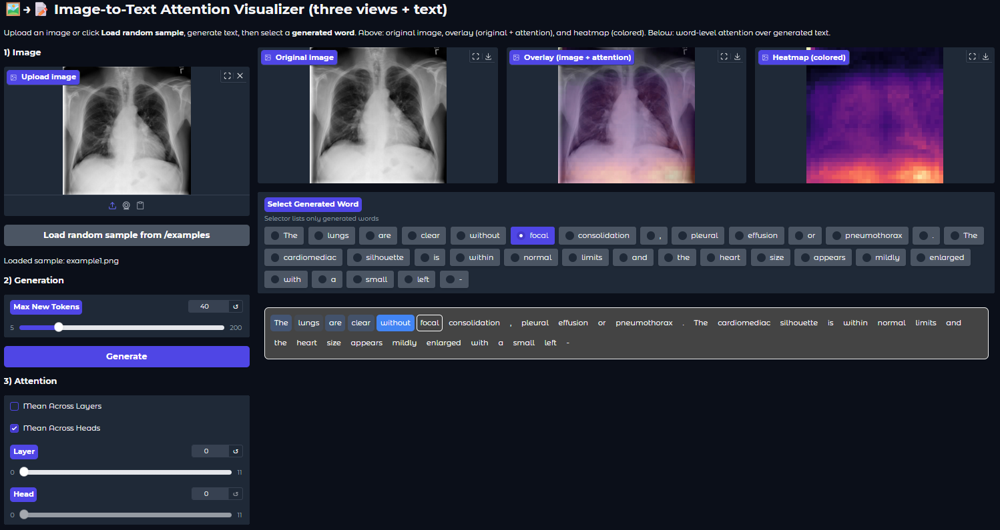

# [Github repo](https://github.com/devMuniz02/Image-Attention-Visualizer)
# [TRY IT NOW ON HUGGING FACE SPACES !!](https://huggingface.co/spaces/manu02/image-attention-visualizer)



# Image-Attention-Visualizer

Image Attention Visualizer is an interactive Gradio app that visualizes **cross-modal attention** between image tokens and generated text tokens in a custom multimodal model. It allows researchers and developers to see how different parts of an image influence the model’s textual output, token by token.

# Image-to-Text Attention Visualizer (Gradio)

An interactive Gradio app to **generate text from an image using a custom multimodal model** and **visualize attention in real time**.
It provides 3 synchronized views — original image, attention overlay, and heatmap — plus a **word-level visualization** showing how each generated word attends to visual regions.

---

## ✨ What the app does

* **Generates text** from an image input using your custom model (`create_complete_model`).
* Displays **three synchronized views**:

  1. 🖼️ **Original image**
  2. 🔥 **Overlay** (original + attention heatmap)
  3. 🌈 **Heatmap alone**
* **Word-level attention viewer**: select any generated word to see how its attention is distributed across the image and previously generated words.
* Works directly with your **custom tokenizer (`model.decoder.tokenizer`)**.
* Fixed-length **1024 image tokens (32×32 grid)** projected as a visual heatmap.
* Adjustable options: **Layer**, **Head**, or **Mean Across Layers/Heads**.

---

## 🚀 Quickstart

### 1) Clone

```bash
git clone https://github.com/devMuniz02/Image-Attention-Visualizer
cd Image-Attention-Visualizer
```

### 2) (Optional) Create a virtual environment

**Windows (PowerShell):**

```powershell
python -m venv venv
.\venv\Scripts\Activate.ps1
```

**macOS / Linux (bash/zsh):**

```bash
python3 -m venv venv
source venv/bin/activate
```

### 3) Install requirements

```bash
pip install -r requirements.txt
```

### 4) Run the app

```bash
python app.py
```

You should see something like:

```
Running on local URL:  http://127.0.0.1:7860
```

### 5) Open in your browser

Navigate to `http://127.0.0.1:7860` to use the app.

---

## 🧭 How to use

1. **Upload an image** or load a random sample from your dataset folder.
2. **Set generation parameters**:

   * Max New Tokens
   * Layer/Head selection (or average across all)
3. Click **Generate** — the model will produce a textual description or continuation.
4. **Select a generated word** from the list:

   * The top row will show:

     * Left → **Original image**
     * Center → **Overlay (attention on image regions)**
     * Right → **Colored heatmap**
   * The bottom section highlights attention strength over the generated words.

---

## 🧩 Files

* `app.py` — Main Gradio interface and visualization logic.
* `utils/models/complete_model.py` — Model definition and generation method.
* `utils/processing.py` — Image preprocessing utilities.
* `requirements.txt` — Dependencies.
* `README.md` — This file.

---

## 🛠️ Troubleshooting

* **Black or blank heatmap:** Ensure your model returns `output_attentions=True` in `.generate()`.
* **Low resolution or distortion:** Adjust `img_size` or the interpolation method inside `_make_overlay`.
* **Tokenizer error:** Make sure `model.decoder.tokenizer` exists and is loaded correctly.
* **OOM errors:** Reduce `max_new_tokens` or use a smaller model checkpoint.
* **Color or shape mismatch:** Verify that your image tokens length = 1024 (for a 32×32 layout).

---

## 🧪 Model integration notes

* The app is compatible with any **encoder–decoder or vision–language model** that:

  * Accepts `pixel_values` as input.
  * Returns `generate(..., output_attentions=True)` with `(gen_ids, gen_text, attentions)`.
* Uses the tokenizer from `model.decoder.tokenizer`.
* Designed for research in **vision-language interpretability**, **cross-modal explainability**, and **attention visualization**.

---

## 📣 Acknowledgments

* Built with [Gradio](https://www.gradio.app/) and [Hugging Face Transformers](https://huggingface.co/docs/transformers).
* Inspired by the original [Token-Attention-Viewer](https://github.com/devMuniz02/Token-Attention-Viewer) project.
* Special thanks to the open-source community advancing **vision-language interpretability**.